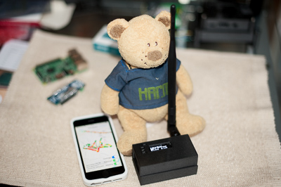
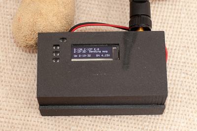

# TTN Mapper node

## Introduction
Small sketch to run a _TTN Mapper_ node on an Adafruit Feather M0 Radio with LoRa Radio Module with an OLED FeatherWing.

 

See https://ttnmapper.org/ for more information about the TTN Mapper project.

## Hardware requirements
- [Adafruit Feather M0 Radio with LoRa Radio Module][1]
- [Adafruit OLED FeatherWing][2]
- Female headers to stack the display on top of the Feather
- Optional:  SMT uFL connector, pigtail and antenna
- Battery. Either a small 4.2/3.7V LiPo battery or a 5V source through the MicroUSB connector

To expose the RFM95 DIO1 to the M0, solder a bridge from the _IO1_ to _Digital #11_ (or any other free port).  
The easiest is to solder this bridge on the FeatherWing.

## Software requirements
Aside the Adafruit SAMD support you will need the following libraries:
- For the OLED FeatherWing:
    - [Adafruit_SSD1306][3]
    - [Adafruit-GFX-Library][4]
- For LoRaWan:
    - [Arduino LMIC][5]

## Running the script
Copy `ttn_secrets_template.h` to `ttn_secrets.h` and set your Application Key and App EUI.  
You also need to define a unique Device EUI -- as the Adafruit Feather does not have a serial number, take the one automatically generated in the TTN console.

By default, the node sends a message with `*` as payload every minute.
- You can change the `send_packet_interval` in `ttn_mapper.cpp` (Respect duty cycle!)
- To send battery voltage as Cayenne LPP instead of `*`, uncomment `#define CAYENNE_LPP` in `ttn_mapper.cpp`

Compile, upload and you should be good to go!

[1]: https://learn.adafruit.com/adafruit-feather-m0-radio-with-lora-radio-module
[2]: https://learn.adafruit.com/adafruit-oled-featherwing
[3]: https://github.com/adafruit/Adafruit_SSD1306
[4]: https://github.com/adafruit/Adafruit-GFX-Library
[5]: https://github.com/matthijskooijman/arduino-lmic
